# 🚀 PLATEFORME CITIL - Cabinet d'Ingénierie des Technologies et Innovation le Leader

[](https://laravel.com)
[](https://reactjs.org)
[](https://tailwindcss.com)
[](https://www.framer.com/motion/)
[](LICENSE)

## 📋 Table des matières

- [🎯 Vue d'ensemble](#-vue-densemble)
- [✨ Fonctionnalités](#-fonctionnalités)
- [🏗️ Architecture technique](#️-architecture-technique)
- [🛠️ Installation et configuration](#️-installation-et-configuration)
- [📁 Structure du projet](#-structure-du-projet)
- [🔧 Configuration](#-configuration)
- [🚀 Déploiement](#-déploiement)
- [📊 Base de données](#-base-de-données)
- [🔐 Authentification](#-authentification)
- [🎨 Interface utilisateur](#-interface-utilisateur)
- [🎭 Animations et interactions](#-animations-et-interactions)
- [🎨 Design System et Styles](#-design-system-et-styles)
- [📊 Schémas et diagrammes](#-schémas-et-diagrammes)
- [📱 Responsive Design](#-responsive-design)
- [🧪 Tests](#-tests)
- [📈 Performance](#-performance)
- [🔒 Sécurité](#-sécurité)
- [📚 API Documentation](#-api-documentation)
- [🤝 Contribution](#-contribution)
- [📞 Support](#-support)
- [📄 Licence](#-licence)

## 🎯 Vue d'ensemble

**CITIL** est une plateforme web complète développée pour le Cabinet d'Ingénierie des Technologies et Innovation le Leader. Cette solution moderne combine un backend Laravel robuste avec un frontend React dynamique pour offrir une expérience utilisateur exceptionnelle dans la gestion des projets technologiques, formations, et services d'ingénierie.

### 🎯 Mission
Accompagner les entreprises et particuliers dans leur transformation numérique en proposant des solutions technologiques innovantes : solaire, électricité, IoT, GPS et formations expertes.

### 🌟 Valeurs
- **Innovation** : Solutions technologiques de pointe
- **Qualité** : Standards internationaux
- **Accompagnement** : Support complet de l'étude à la maintenance
- **Accessibilité** : Technologies adaptées à tous les budgets

## ✨ Fonctionnalités

### 🏠 **Page d'accueil**
- **Hero Section** : Présentation impactante avec animations
- **Services** : 6 services principaux (Solaire, GPS, Maintenance, Électricité, Vente, SAV)
- **À propos** : Présentation de l'entreprise et valeurs
- **Produits vedettes** : Affichage dynamique des produits
- **Témoignages** : Carrousel de témoignages clients
- **Formations** : Présentation des formations disponibles
- **Call-to-Action** : Section contact et boutique

### 🛒 **Boutique en ligne**
- **Catalogue produits** : Affichage dynamique depuis la base de données
- **Filtrage par catégorie** : Navigation intuitive
- **Recherche** : Fonction de recherche avancée
- **Détails produits** : Pages détaillées avec images
- **Gestion du stock** : Suivi en temps réel

### 🎓 **Formations**
- **Catalogue formations** : Liste complète des formations
- **Détails formation** : Informations détaillées (prix, durée, programme)
- **Inscription** : Système d'inscription en ligne
- **Gestion des participants** : Suivi des inscriptions

### 📝 **Blog**
- **Articles** : Publication d'articles techniques
- **Catégorisation** : Organisation par catégories
- **Recherche** : Fonction de recherche dans les articles
- **Commentaires** : Système d'interaction

### 👥 **Gestion des utilisateurs**
- **Inscription** : Processus d'inscription simplifié
- **Connexion** : Authentification sécurisée
- **Profil utilisateur** : Gestion des informations personnelles
- **Rôles** : Système d'administration

### 🔧 **Administration**
- **Dashboard** : Vue d'ensemble des statistiques
- **Gestion produits** : CRUD complet des produits
- **Gestion formations** : Administration des formations
- **Gestion utilisateurs** : Administration des comptes
- **Gestion commandes** : Suivi des commandes
- **Gestion blog** : Publication d'articles
- **Statistiques** : Tableaux de bord détaillés

### 📞 **Contact et support**
- **Formulaire de contact** : Communication directe
- **Candidatures stage** : Système de candidature
- **Support technique** : Assistance 24/7

## 🏗️ Architecture technique

### **Backend (Laravel 12.x)**
```
📦 citil-backend/
├── 🎯 API RESTful avec Laravel Sanctum
├── 🗄️ Base de données SQLite (développement)
├── 🔐 Authentification JWT
├── 📊 Migrations et Seeders
├── 🧪 Tests unitaires et fonctionnels
└── 📝 Documentation API automatique
```

### **Frontend (React 19.x)**
```
📦 citil-frontend/
├── ⚛️ React 19 avec Hooks
├── 🎨 Tailwind CSS pour le styling
├── 🎭 Framer Motion pour les animations
├── 🛣️ React Router pour la navigation
├── 📡 Axios pour les appels API
└── 📱 Design responsive mobile-first
```

### **Stack technologique complet**
- **Backend** : Laravel 12.x, PHP 8.2+, SQLite
- **Frontend** : React 19.x, Tailwind CSS 3.x, Framer Motion 12.x
- **Base de données** : SQLite (dev), MySQL/PostgreSQL (prod)
- **Authentification** : Laravel Sanctum
- **API** : RESTful avec documentation automatique
- **Animations** : Framer Motion
- **Styling** : Tailwind CSS avec design system personnalisé
- **Build** : Vite (Laravel), Create React App
- **Versioning** : Git avec conventions de commit

## 🛠️ Installation et configuration

### **Prérequis système**

#### **Backend (Laravel)**
- PHP 8.2 ou supérieur
- Composer 2.x
- SQLite 3.x (ou MySQL/PostgreSQL pour la production)
- Extensions PHP : BCMath, Ctype, Fileinfo, JSON, Mbstring, OpenSSL, PDO, Tokenizer, XML

#### **Frontend (React)**
- Node.js 18.x ou supérieur
- npm 9.x ou supérieur
- Navigateur moderne (Chrome, Firefox, Safari, Edge)

### **Installation complète**

#### **1. Cloner le repository**
```bash
git clone https://github.com/votre-username/PLATEFORME-CITIL.git
cd PLATEFORME-CITIL
```

#### **2. Configuration du Backend**
```bash
# Aller dans le dossier backend
cd citil-backend

# Installer les dépendances PHP
composer install

# Copier le fichier d'environnement
cp .env.example .env

# Générer la clé d'application
php artisan key:generate

# Créer la base de données SQLite
touch database/database.sqlite

# Exécuter les migrations
php artisan migrate

# Créer l'utilisateur admin
php artisan db:seed

# Démarrer le serveur de développement
php artisan serve --host=0.0.0.0 --port=8001
```

#### **3. Configuration du Frontend**
```bash
# Aller dans le dossier frontend
cd citil-frontend

# Installer les dépendances Node.js
npm install

# Démarrer le serveur de développement
npm start
```

#### **4. Accès à l'application**
- **Frontend** : http://localhost:3000
- **Backend API** : http://localhost:8001
- **Admin** : http://localhost:3000/admin-login
  - Email : `admin@citil.tg`
  - Mot de passe : `password`

### **Script d'installation automatique**

Un script `reset-database.sh` est disponible pour réinitialiser rapidement la base de données :

```bash
chmod +x reset-database.sh
./reset-database.sh
```

## 📁 Structure du projet

### **Structure générale**
```
PLATEFORME-CITIL/
├── 📁 citil-backend/          # Backend Laravel
├── 📁 citil-frontend/         # Frontend React
├── 📄 README.md               # Documentation principale
├── 📄 reset-database.sh       # Script de réinitialisation
└── 📄 INSTALL.md              # Guide d'installation détaillé
```

### **Backend Laravel**
```
citil-backend/
├── 📁 app/
│   ├── 📁 Http/Controllers/Api/    # Contrôleurs API
│   ├── 📁 Models/                  # Modèles Eloquent
│   └── 📁 Providers/               # Service Providers
├── 📁 database/
│   ├── 📁 migrations/              # Migrations de base de données
│   └── 📁 seeders/                 # Seeders pour les données initiales
├── 📁 routes/
│   └── 📄 api.php                  # Routes API
├── 📁 storage/                     # Stockage des fichiers
├── 📄 artisan                      # CLI Laravel
├── 📄 composer.json                # Dépendances PHP
└── 📄 .env                         # Configuration environnement
```

### **Frontend React**
```
citil-frontend/
├── 📁 public/                      # Fichiers statiques
│   └── 📁 assets/                  # Images et ressources
├── 📁 src/
│   ├── 📁 components/              # Composants réutilisables
│   ├── 📁 pages/                   # Pages de l'application
│   ├── 📁 context/                 # Context React
│   ├── 📁 services/                # Services API
│   ├── 📁 styles/                  # Styles CSS
│   └── 📁 utils/                   # Utilitaires
├── 📄 package.json                 # Dépendances Node.js
└── 📄 tailwind.config.js           # Configuration Tailwind
```

## 🔧 Configuration

### **Variables d'environnement Backend (.env)**
```env
APP_NAME="CITIL Platform"
APP_ENV=local
APP_KEY=base64:your-app-key
APP_DEBUG=true
APP_URL=http://localhost:8001

DB_CONNECTION=sqlite
DB_DATABASE=/path/to/database.sqlite

SANCTUM_STATEFUL_DOMAINS=localhost:3000
SESSION_DRIVER=database
SESSION_LIFETIME=120
```

### **Configuration Frontend (src/services/api.js)**
```javascript
const API_URL = 'http://localhost:8001';
const api = axios.create({
  baseURL: API_URL,
  withCredentials: true,
  headers: {
    'Accept': 'application/json',
    'Content-Type': 'application/json',
  },
});
```

### **Configuration Tailwind CSS**
```javascript
module.exports = {
  content: [
    "./src/**/*.{js,jsx,ts,tsx}",
  ],
  theme: {
    extend: {
      colors: {
        primary: '#3498DB',
        secondary: '#2C3E50',
        accent: '#2ECC71',
      },
    },
  },
  plugins: [],
}
```

## 🚀 Déploiement

### **Déploiement Backend (Production)**

#### **1. Configuration serveur**
```bash
# Installer PHP 8.2+ et extensions
sudo apt update
sudo apt install php8.2-fpm php8.2-mysql php8.2-xml php8.2-mbstring

# Installer Composer
curl -sS https://getcomposer.org/installer | php
sudo mv composer.phar /usr/local/bin/composer

# Installer Nginx
sudo apt install nginx
```

#### **2. Configuration Laravel**
```bash
# Cloner le projet
git clone https://github.com/votre-username/PLATEFORME-CITIL.git
cd PLATEFORME-CITIL/citil-backend

# Installer les dépendances
composer install --optimize-autoloader --no-dev

# Configuration environnement
cp .env.example .env
# Modifier .env pour la production

# Générer la clé
php artisan key:generate

# Migrations et seeders
php artisan migrate --force
php artisan db:seed

# Optimisations
php artisan config:cache
php artisan route:cache
php artisan view:cache
```

#### **3. Configuration Nginx**
```nginx
server {
    listen 80;
    server_name votre-domaine.com;
    root /path/to/PLATEFORME-CITIL/citil-backend/public;

    add_header X-Frame-Options "SAMEORIGIN";
    add_header X-Content-Type-Options "nosniff";

    index index.php;

    charset utf-8;

    location / {
        try_files $uri $uri/ /index.php?$query_string;
    }

    location = /favicon.ico { access_log off; log_not_found off; }
    location = /robots.txt  { access_log off; log_not_found off; }

    error_page 404 /index.php;

    location ~ \.php$ {
        fastcgi_pass unix:/var/run/php/php8.2-fpm.sock;
        fastcgi_param SCRIPT_FILENAME $realpath_root$fastcgi_script_name;
        include fastcgi_params;
    }

    location ~ /\.(?!well-known).* {
        deny all;
    }
}
```

### **Déploiement Frontend (Production)**

#### **1. Build de production**
```bash
cd citil-frontend

# Installer les dépendances
npm install

# Build de production
npm run build
```

#### **2. Configuration serveur web**
```nginx
server {
    listen 80;
    server_name votre-domaine.com;
    root /path/to/PLATEFORME-CITIL/citil-frontend/build;
    index index.html;

    location / {
        try_files $uri $uri/ /index.html;
    }

    location /static/ {
        expires 1y;
        add_header Cache-Control "public, immutable";
    }
}
```

## 📊 Base de données

### **Modèles principaux**

#### **Users (Utilisateurs)**
```sql
- id (Primary Key)
- name (Nom complet)
- email (Email unique)
- email_verified_at (Vérification email)
- password (Mot de passe hashé)
- phone (Téléphone)
- role (admin/client)
- avatar (Photo de profil)
- created_at, updated_at
```

#### **Products (Produits)**
```sql
- id (Primary Key)
- name (Nom du produit)
- description (Description détaillée)
- price (Prix en CFA)
- image (URL de l'image)
- stock (Quantité en stock)
- category_id (Foreign Key)
- created_at, updated_at
```

#### **Categories (Catégories)**
```sql
- id (Primary Key)
- name (Nom de la catégorie)
- slug (Slug URL)
- description (Description)
- created_at, updated_at
```

#### **Trainings (Formations)**
```sql
- id (Primary Key)
- title (Titre de la formation)
- description (Description)
- price (Prix en CFA)
- duration_hours (Durée en heures)
- start_date (Date de début)
- image (URL de l'image)
- created_at, updated_at
```

#### **Orders (Commandes)**
```sql
- id (Primary Key)
- user_id (Foreign Key)
- total_amount (Montant total)
- status (Statut de la commande)
- shipping_address (Adresse de livraison)
- created_at, updated_at
```

#### **Blog Posts (Articles de blog)**
```sql
- id (Primary Key)
- title (Titre de l'article)
- content (Contenu)
- excerpt (Extrait)
- image (URL de l'image)
- category_id (Foreign Key)
- published (Publié ou non)
- created_at, updated_at
```

### **Relations entre modèles**
- `User` → `Orders` (1:N)
- `Category` → `Products` (1:N)
- `Category` → `BlogPosts` (1:N)
- `Order` → `OrderItems` (1:N)
- `Product` → `OrderItems` (1:N)

### **Migrations disponibles**
- `create_users_table` : Table des utilisateurs
- `create_categories_table` : Table des catégories
- `create_products_table` : Table des produits
- `create_trainings_table` : Table des formations
- `create_orders_table` : Table des commandes
- `create_order_items_table` : Table des articles de commande
- `create_blog_categories_table` : Table des catégories de blog
- `create_blog_posts_table` : Table des articles de blog
- `create_internship_applications_table` : Table des candidatures de stage
- `create_projects_table` : Table des projets
- `create_registrations_table` : Table des inscriptions aux formations

## 🔐 Authentification

### **Système d'authentification Laravel Sanctum**

#### **Inscription utilisateur**
```javascript
// POST /api/register
{
  "name": "John Doe",
  "email": "john@example.com",
  "password": "password123",
  "password_confirmation": "password123",
  "phone": "+228 90 00 00 00"
}
```

#### **Connexion utilisateur**
```javascript
// POST /api/login
{
  "email": "john@example.com",
  "password": "password123"
}

// Réponse
{
  "status": "success",
  "token": "1|abc123...",
  "user": {
    "id": 1,
    "name": "John Doe",
    "email": "john@example.com",
    "role": "client"
  }
}
```

#### **Utilisation du token**
```javascript
// Headers pour les requêtes authentifiées
Authorization: Bearer 1|abc123...
```

### **Rôles et permissions**

#### **Rôles disponibles**
- **admin** : Accès complet à l'administration
- **client** : Accès aux fonctionnalités publiques

#### **Routes protégées**
- `/api/admin/*` : Toutes les routes d'administration
- `/api/user` : Informations utilisateur
- `/api/profile` : Mise à jour du profil

### **Sécurité**
- **Hachage des mots de passe** : Bcrypt
- **Tokens CSRF** : Protection contre les attaques CSRF
- **Validation des données** : Validation côté serveur
- **Rate limiting** : Limitation des tentatives de connexion
- **HTTPS** : Chiffrement des communications (production)

## 🎨 Interface utilisateur

### **Design System**

#### **Palette de couleurs**
```css
Primary: #3498DB (Bleu principal)
Secondary: #2C3E50 (Bleu foncé)
Accent: #2ECC71 (Vert)
Success: #27AE60 (Vert foncé)
Warning: #F1C40F (Jaune)
Danger: #E74C3C (Rouge)
Light: #F9F9EA (Beige clair)
Dark: #2C3E50 (Bleu foncé)
```

#### **Typographie**
- **Titres** : Font-bold, tailles responsives
- **Corps** : Font-normal, line-height optimisé
- **Navigation** : Font-semibold
- **Boutons** : Font-semibold

#### **Composants réutilisables**

##### **Button**
```jsx
<Button 
  variant="primary" 
  size="lg" 
  loading={false}
  disabled={false}
>
  Texte du bouton
</Button>
```

##### **Card**
```jsx
<Card 
  title="Titre de la carte"
  subtitle="Sous-titre optionnel"
>
  Contenu de la carte
</Card>
```

##### **FormInput**
```jsx
<FormInput.Label>Email</FormInput.Label>
<FormInput.Input 
  type="email" 
  value={email}
  onChange={setEmail}
/>
<FormInput.FieldError error={emailError} />
```

## 🎭 Animations et interactions

### **Système d'animations Framer Motion**

#### **Types d'animations disponibles**

##### **1. Animations d'entrée (Page Load)**
```jsx
// Animation fade-in avec mouvement vertical
<motion.div
  initial={{ opacity: 0, y: 30 }}
  animate={{ opacity: 1, y: 0 }}
  transition={{ duration: 0.6, ease: "easeOut" }}
>
  Contenu animé
</motion.div>

// Animation avec délai progressif
<motion.div
  initial={{ opacity: 0, x: -50 }}
  animate={{ opacity: 1, x: 0 }}
  transition={{ duration: 0.8, delay: 0.2 }}
>
  Élément avec délai
</motion.div>
```

##### **2. Animations au scroll (Scroll-triggered)**
```jsx
// Animation qui se déclenche au scroll
<motion.div
  initial={{ opacity: 0, y: 50 }}
  whileInView={{ opacity: 1, y: 0 }}
  viewport={{ once: true, margin: "-100px" }}
  transition={{ duration: 0.8, ease: "easeOut" }}
>
  Contenu qui apparaît au scroll
</motion.div>

// Animation en cascade
<motion.div
  initial={{ opacity: 0, y: 30 }}
  whileInView={{ opacity: 1, y: 0 }}
  viewport={{ once: true }}
  transition={{ duration: 0.6, delay: 0.1 * index }}
>
  Élément avec délai basé sur l'index
</motion.div>
```

##### **3. Animations d'interaction (Hover/Tap)**
```jsx
// Bouton avec effet hover
<motion.button
  whileHover={{ 
    scale: 1.05, 
    y: -2,
    transition: { duration: 0.2 }
  }}
  whileTap={{ 
    scale: 0.95,
    transition: { duration: 0.1 }
  }}
  className="px-6 py-3 bg-blue-500 text-white rounded-lg"
>
  Bouton interactif
</motion.button>

// Carte avec effet de survol
<motion.div
  whileHover={{ 
    y: -8, 
    scale: 1.02,
    boxShadow: "0 20px 25px -5px rgba(0, 0, 0, 0.1)"
  }}
  transition={{ duration: 0.3, ease: "easeOut" }}
  className="bg-white rounded-xl p-6 shadow-lg"
>
  Carte interactive
</motion.div>
```

##### **4. Animations continues (Loop)**
```jsx
// Rotation continue
<motion.div
  animate={{ rotate: 360 }}
  transition={{ 
    duration: 2, 
    repeat: Infinity, 
    ease: "linear" 
  }}
  className="w-8 h-8 border-2 border-blue-500 border-t-transparent rounded-full"
/>

// Pulsation
<motion.div
  animate={{ 
    scale: [1, 1.1, 1],
    opacity: [0.7, 1, 0.7]
  }}
  transition={{ 
    duration: 2, 
    repeat: Infinity,
    ease: "easeInOut"
  }}
  className="w-4 h-4 bg-green-500 rounded-full"
/>
```

##### **5. Animations de transition de page**
```jsx
// Transition entre pages
<AnimatePresence mode="wait">
  <motion.div
    key={location.pathname}
    initial={{ opacity: 0, x: 20 }}
    animate={{ opacity: 1, x: 0 }}
    exit={{ opacity: 0, x: -20 }}
    transition={{ duration: 0.3 }}
  >
    <Routes>
      {/* Routes */}
    </Routes>
  </motion.div>
</AnimatePresence>
```

### **Animations spécifiques par composant**

#### **Hero Section**
```jsx
// Titre principal avec animation d'apparition
<motion.h1
  initial={{ opacity: 0, y: 50 }}
  animate={{ opacity: 1, y: 0 }}
  transition={{ duration: 1, delay: 0.5 }}
  className="text-6xl font-bold"
>
  Votre Survie Dépend De La Technologie
</motion.h1>

// Éléments flottants en arrière-plan
<motion.div
  animate={{
    x: [0, 100, 0],
    y: [0, -50, 0],
    scale: [1, 1.2, 1],
  }}
  transition={{
    duration: 8,
    repeat: Infinity,
    ease: "easeInOut"
  }}
  className="absolute w-32 h-32 bg-blue-500/10 rounded-full blur-3xl"
/>
```

#### **Cartes de statistiques**
```jsx
// Animation d'apparition en cascade
<motion.div
  initial={{ opacity: 0, y: 30 }}
  whileInView={{ opacity: 1, y: 0 }}
  viewport={{ once: true }}
  transition={{ 
    duration: 0.6, 
    delay: 1.4 + index * 0.2 
  }}
  whileHover={{ scale: 1.05, y: -5 }}
  className="bg-white/90 rounded-2xl p-8 shadow-xl"
>
  <div className="text-4xl mb-3">🚀</div>
  <div className="text-4xl font-bold text-[#2C3E50] mb-2">500+</div>
  <div className="text-gray-600 font-medium">Projets réalisés</div>
</motion.div>
```

#### **Carrousel de témoignages**
```jsx
// Animation de défilement continu
<motion.div
  className="flex gap-8"
  initial={{ x: 0 }}
  animate={{ x: ['0%', '-50%'] }}
  transition={{ 
    duration: 30, 
    ease: 'linear', 
    repeat: Infinity 
  }}
  style={{ width: '200%' }}
>
  {testimonials.map((testimonial, index) => (
    <motion.div
      key={index}
      initial={{ opacity: 0, y: 20 }}
      animate={{ opacity: 1, y: 0 }}
      transition={{ duration: 0.6, delay: index * 0.1 }}
      className="w-[28%] shrink-0"
    >
      {/* Contenu du témoignage */}
    </motion.div>
  ))}
</motion.div>
```

### **Performance des animations**

#### **Optimisations**
```jsx
// Utilisation de will-change pour les performances
<motion.div
  style={{ willChange: 'transform, opacity' }}
  animate={{ scale: 1.1 }}
>
  Élément optimisé
</motion.div>

// Animation avec GPU acceleration
<motion.div
  animate={{ 
    x: 100,
    scale: 1.1 
  }}
  transition={{ 
    type: "spring",
    stiffness: 100,
    damping: 10
  }}
>
  Animation fluide
</motion.div>
```

#### **Réduction des animations sur mobile**
```jsx
// Détection de la préférence utilisateur
const prefersReducedMotion = window.matchMedia('(prefers-reduced-motion: reduce)').matches;

<motion.div
  animate={prefersReducedMotion ? {} : { opacity: 1, y: 0 }}
  transition={prefersReducedMotion ? {} : { duration: 0.6 }}
>
  Contenu adaptatif
</motion.div>
```

## 🎨 Design System et Styles

### **Système de couleurs étendu**

#### **Palette principale**
```css
/* Couleurs primaires */
--primary-50: #EBF8FF;
--primary-100: #BEE3F8;
--primary-200: #90CDF4;
--primary-300: #63B3ED;
--primary-400: #4299E1;
--primary-500: #3498DB;  /* Couleur principale */
--primary-600: #2980B9;
--primary-700: #1E6BA8;
--primary-800: #1A5A96;
--primary-900: #1A4A85;

/* Couleurs secondaires */
--secondary-50: #F8FAFC;
--secondary-100: #F1F5F9;
--secondary-200: #E2E8F0;
--secondary-300: #CBD5E1;
--secondary-400: #94A3B8;
--secondary-500: #64748B;
--secondary-600: #475569;
--secondary-700: #334155;
--secondary-800: #2C3E50;  /* Couleur secondaire */
--secondary-900: #0F172A;

/* Couleurs d'accent */
--accent-50: #F0FDF4;
--accent-100: #DCFCE7;
--accent-200: #BBF7D0;
--accent-300: #86EFAC;
--accent-400: #4ADE80;
--accent-500: #2ECC71;  /* Couleur d'accent */
--accent-600: #16A085;
--accent-700: #15803D;
--accent-800: #166534;
--accent-900: #14532D;
```

#### **Couleurs sémantiques**
```css
/* États et feedback */
--success: #27AE60;
--warning: #F1C40F;
--error: #E74C3C;
--info: #3498DB;

/* Couleurs neutres */
--gray-50: #F9FAFB;
--gray-100: #F3F4F6;
--gray-200: #E5E7EB;
--gray-300: #D1D5DB;
--gray-400: #9CA3AF;
--gray-500: #6B7280;
--gray-600: #4B5563;
--gray-700: #374151;
--gray-800: #1F2937;
--gray-900: #111827;
```

### **Système de typographie**

#### **Échelle typographique**
```css
/* Tailles de police */
--text-xs: 0.75rem;     /* 12px */
--text-sm: 0.875rem;    /* 14px */
--text-base: 1rem;      /* 16px */
--text-lg: 1.125rem;    /* 18px */
--text-xl: 1.25rem;     /* 20px */
--text-2xl: 1.5rem;     /* 24px */
--text-3xl: 1.875rem;   /* 30px */
--text-4xl: 2.25rem;    /* 36px */
--text-5xl: 3rem;       /* 48px */
--text-6xl: 3.75rem;    /* 60px */
--text-7xl: 4.5rem;     /* 72px */

/* Poids de police */
--font-thin: 100;
--font-extralight: 200;
--font-light: 300;
--font-normal: 400;
--font-medium: 500;
--font-semibold: 600;
--font-bold: 700;
--font-extrabold: 800;
--font-black: 900;

/* Hauteurs de ligne */
--leading-none: 1;
--leading-tight: 1.25;
--leading-snug: 1.375;
--leading-normal: 1.5;
--leading-relaxed: 1.625;
--leading-loose: 2;
```

#### **Styles de texte prédéfinis**
```css
/* Titres */
.heading-1 {
  font-size: var(--text-6xl);
  font-weight: var(--font-bold);
  line-height: var(--leading-tight);
  color: var(--secondary-800);
}

.heading-2 {
  font-size: var(--text-4xl);
  font-weight: var(--font-bold);
  line-height: var(--leading-tight);
  color: var(--secondary-700);
}

.heading-3 {
  font-size: var(--text-2xl);
  font-weight: var(--font-semibold);
  line-height: var(--leading-snug);
  color: var(--secondary-700);
}

/* Corps de texte */
.body-large {
  font-size: var(--text-lg);
  font-weight: var(--font-normal);
  line-height: var(--leading-relaxed);
  color: var(--gray-700);
}

.body-medium {
  font-size: var(--text-base);
  font-weight: var(--font-normal);
  line-height: var(--leading-normal);
  color: var(--gray-600);
}

.body-small {
  font-size: var(--text-sm);
  font-weight: var(--font-normal);
  line-height: var(--leading-normal);
  color: var(--gray-500);
}
```

### **Système d'espacement**

#### **Échelle d'espacement**
```css
/* Espacement uniforme */
--space-0: 0;
--space-1: 0.25rem;   /* 4px */
--space-2: 0.5rem;    /* 8px */
--space-3: 0.75rem;   /* 12px */
--space-4: 1rem;      /* 16px */
--space-5: 1.25rem;   /* 20px */
--space-6: 1.5rem;    /* 24px */
--space-8: 2rem;      /* 32px */
--space-10: 2.5rem;   /* 40px */
--space-12: 3rem;     /* 48px */
--space-16: 4rem;     /* 64px */
--space-20: 5rem;     /* 80px */
--space-24: 6rem;     /* 96px */
--space-32: 8rem;     /* 128px */
--space-40: 10rem;    /* 160px */
--space-48: 12rem;    /* 192px */
--space-56: 14rem;    /* 224px */
--space-64: 16rem;    /* 256px */
```

### **Système de composants**

#### **Boutons**
```jsx
// Variantes de boutons
const buttonVariants = {
  primary: "bg-[#3498DB] text-white hover:bg-[#2980B9] focus:ring-2 focus:ring-[#3498DB] focus:ring-offset-2",
  secondary: "bg-white text-[#3498DB] border-2 border-[#3498DB] hover:bg-[#3498DB] hover:text-white",
  success: "bg-[#2ECC71] text-white hover:bg-[#27AE60] focus:ring-2 focus:ring-[#2ECC71]",
  danger: "bg-[#E74C3C] text-white hover:bg-[#C0392B] focus:ring-2 focus:ring-[#E74C3C]",
  ghost: "bg-transparent text-[#3498DB] hover:bg-[#3498DB] hover:text-white"
};

// Tailles de boutons
const buttonSizes = {
  sm: "px-3 py-1.5 text-sm",
  md: "px-4 py-2 text-base",
  lg: "px-6 py-3 text-lg",
  xl: "px-8 py-4 text-xl"
};
```

#### **Cartes**
```jsx
// Système de cartes
const cardVariants = {
  default: "bg-white rounded-xl shadow-lg border border-gray-200",
  elevated: "bg-white rounded-xl shadow-2xl border border-gray-100",
  outlined: "bg-transparent rounded-xl border-2 border-gray-300",
  filled: "bg-gray-50 rounded-xl border border-gray-200"
};

// Tailles de cartes
const cardSizes = {
  sm: "p-4",
  md: "p-6",
  lg: "p-8",
  xl: "p-10"
};
```

#### **Formulaires**
```jsx
// Styles de champs de formulaire
const inputStyles = {
  base: "w-full px-4 py-3 border border-gray-300 rounded-lg focus:ring-2 focus:ring-[#3498DB] focus:border-transparent transition-colors",
  error: "border-red-500 focus:ring-red-500",
  success: "border-green-500 focus:ring-green-500",
  disabled: "bg-gray-100 cursor-not-allowed opacity-50"
};
```

### **Thèmes et modes**

#### **Mode sombre (Dark Mode)**
```css
/* Variables CSS pour le mode sombre */
@media (prefers-color-scheme: dark) {
  :root {
    --bg-primary: #0F172A;
    --bg-secondary: #1E293B;
    --text-primary: #F8FAFC;
    --text-secondary: #CBD5E1;
    --border-color: #334155;
  }
}

/* Classes Tailwind pour le mode sombre */
.dark {
  --tw-bg-opacity: 1;
  background-color: rgb(15 23 42 / var(--tw-bg-opacity));
  color: rgb(248 250 252 / var(--tw-text-opacity));
}
```

#### **Thème personnalisé**
```javascript
// Configuration Tailwind pour thème personnalisé
module.exports = {
  theme: {
    extend: {
      colors: {
        primary: {
          50: '#EBF8FF',
          500: '#3498DB',
          900: '#1A4A85',
        },
        secondary: {
          50: '#F8FAFC',
          500: '#2C3E50',
          900: '#0F172A',
        }
      },
      fontFamily: {
        'sans': ['Inter', 'system-ui', 'sans-serif'],
        'display': ['Poppins', 'system-ui', 'sans-serif'],
      },
      animation: {
        'fade-in': 'fadeIn 0.6s ease-out',
        'slide-up': 'slideUp 0.8s ease-out',
        'bounce-gentle': 'bounceGentle 2s infinite',
      },
      keyframes: {
        fadeIn: {
          '0%': { opacity: '0' },
          '100%': { opacity: '1' },
        },
        slideUp: {
          '0%': { transform: 'translateY(30px)', opacity: '0' },
          '100%': { transform: 'translateY(0)', opacity: '1' },
        },
        bounceGentle: {
          '0%, 100%': { transform: 'translateY(0)' },
          '50%': { transform: 'translateY(-10px)' },
        }
      }
    }
  }
}
```

## 📊 Schémas et diagrammes

### **Architecture générale du système**


### **Schéma de base de données**

```mermaid
erDiagram
    USERS {
        int id PK
        string name
        string email UK
        timestamp email_verified_at
        string password
        string phone
        string role
        string avatar
        timestamp created_at
        timestamp updated_at
    }
    
    CATEGORIES {
        int id PK
        string name
        string slug UK
        text description
        timestamp created_at
        timestamp updated_at
    }
    
    PRODUCTS {
        int id PK
        string name
        text description
        decimal price
        string image
        int stock
        int category_id FK
        timestamp created_at
        timestamp updated_at
    }
    
    TRAININGS {
        int id PK
        string title
        text description
        decimal price
        int duration_hours
        date start_date
        string image
        timestamp created_at
        timestamp updated_at
    }
    
    ORDERS {
        int id PK
        int user_id FK
        decimal total_amount
        string status
        text shipping_address
        timestamp created_at
        timestamp updated_at
    }
    
    ORDER_ITEMS {
        int id PK
        int order_id FK
        int product_id FK
        int quantity
        decimal price
        timestamp created_at
        timestamp updated_at
    }
    
    BLOG_CATEGORIES {
        int id PK
        string name
        string slug UK
        text description
        timestamp created_at
        timestamp updated_at
    }
    
    BLOG_POSTS {
        int id PK
        string title
        text content
        text excerpt
        string image
        int category_id FK
        boolean published
        timestamp created_at
        timestamp updated_at
    }
    
    USERS ||--o{ ORDERS : "places"
    CATEGORIES ||--o{ PRODUCTS : "contains"
    CATEGORIES ||--o{ BLOG_POSTS : "categorizes"
    ORDERS ||--o{ ORDER_ITEMS : "contains"
    PRODUCTS ||--o{ ORDER_ITEMS : "included_in"
    BLOG_CATEGORIES ||--o{ BLOG_POSTS : "categorizes"
```



### **Flux d'authentification**


### **Flux de commande**

```mermaid
flowchart TD
    A[Utilisateur visite boutique] --> B[Parcourt les produits]
    B --> C[Clique sur produit]
    C --> D[Ajoute au panier]
    D --> E[Vérifie stock]
    E --> F{Stock disponible?}
    F -->|Oui| G[Confirme commande]
    F -->|Non| H[Affiche erreur]
    G --> I[Saisit adresse livraison]
    I --> J[Confirme paiement]
    J --> K[Crée commande en DB]
    K --> L[Envoie email confirmation]
    L --> M[Met à jour stock]
    M --> N[Commande traitée]
```



### **Architecture des composants React**


### **Structure des fichiers**

```
PLATEFORME-CITIL/
├── 📁 citil-backend/                 # Backend Laravel
│   ├── 📁 app/
│   │   ├── 📁 Http/Controllers/Api/  # Contrôleurs API
│   │   │   ├── 📄 AuthController.php
│   │   │   ├── 📄 ProductController.php
│   │   │   ├── 📄 TrainingController.php
│   │   │   ├── 📄 UserController.php
│   │   │   └── 📄 BlogPostController.php
│   │   ├── 📁 Models/                # Modèles Eloquent
│   │   │   ├── 📄 User.php
│   │   │   ├── 📄 Product.php
│   │   │   ├── 📄 Training.php
│   │   │   ├── 📄 Order.php
│   │   │   └── 📄 BlogPost.php
│   │   └── 📁 Providers/
│   ├── 📁 database/
│   │   ├── 📁 migrations/            # Migrations DB
│   │   └── 📁 seeders/               # Seeders
│   ├── 📁 routes/
│   │   └── 📄 api.php                # Routes API
│   └── 📄 composer.json
├── 📁 citil-frontend/                # Frontend React
│   ├── 📁 public/
│   │   └── 📁 assets/                # Images et ressources
│   ├── 📁 src/
│   │   ├── 📁 components/            # Composants réutilisables
│   │   │   ├── 📄 Button.jsx
│   │   │   ├── 📄 Card.jsx
│   │   │   ├── 📄 Hero.jsx
│   │   │   ├── 📄 ProductCard.jsx
│   │   │   └── 📄 ui/
│   │   ├── 📁 pages/                 # Pages de l'application
│   │   │   ├── 📄 Home.jsx
│   │   │   ├── 📄 Shop.jsx
│   │   │   ├── 📄 Trainings.jsx
│   │   │   ├── 📄 Blog.jsx
│   │   │   ├── 📄 Profile.jsx
│   │   │   └── 📁 admin/
│   │   ├── 📁 context/               # Context React
│   │   │   ├── 📄 AuthContext.js
│   │   │   └── 📄 ThemeContext.js
│   │   ├── 📁 services/              # Services API
│   │   │   └── 📄 api.js
│   │   ├── 📁 styles/                # Styles CSS
│   │   │   └── 📄 responsive.css
│   │   └── 📁 utils/                 # Utilitaires
│   │       └── 📄 helpers.js
│   ├── 📄 package.json
│   └── 📄 tailwind.config.js
└── 📄 README.md                      # Documentation
```

### **Diagramme de déploiement**


### **Métriques de performance**


Ces schémas et diagrammes fournissent une vue d'ensemble complète de l'architecture, des flux de données, et de la structure du projet CITIL.

## 📱 Responsive Design

### **Breakpoints Tailwind**
```css
sm: 640px   /* Mobile large */
md: 768px   /* Tablette */
lg: 1024px  /* Desktop */
xl: 1280px  /* Desktop large */
2xl: 1536px /* Desktop très large */
```

### **Stratégie mobile-first**
- **Design mobile** : Base de tous les styles
- **Progressive enhancement** : Amélioration pour les écrans plus grands
- **Touch-friendly** : Boutons et liens adaptés au tactile
- **Performance** : Images et assets optimisés

### **Composants responsives**

#### **Navigation**
```jsx
// Mobile : Menu hamburger
// Desktop : Menu horizontal
<div className="flex flex-col sm:flex-row">
  <div className="sm:hidden">Menu mobile</div>
  <div className="hidden sm:flex">Menu desktop</div>
</div>
```

#### **Grilles responsives**
```jsx
// 1 colonne mobile, 2 tablettes, 3 desktop
<div className="grid grid-cols-1 md:grid-cols-2 lg:grid-cols-3 gap-6">
  {items.map(item => <ItemCard key={item.id} item={item} />)}
</div>
```

## 🧪 Tests

### **Tests Backend (PHPUnit)**

#### **Tests unitaires**
```bash
# Exécuter tous les tests
php artisan test

# Tests spécifiques
php artisan test --filter=UserTest

# Tests avec couverture
php artisan test --coverage
```

#### **Tests d'API**
```php
// Exemple de test API
public function test_user_can_register()
{
    $response = $this->postJson('/api/register', [
        'name' => 'Test User',
        'email' => 'test@example.com',
        'password' => 'password123',
        'password_confirmation' => 'password123'
    ]);

    $response->assertStatus(201)
             ->assertJsonStructure(['status', 'token', 'user']);
}
```

### **Tests Frontend (Jest + React Testing Library)**

#### **Tests de composants**
```bash
# Exécuter tous les tests
npm test

# Tests en mode watch
npm test -- --watch

# Tests avec couverture
npm test -- --coverage
```

#### **Tests d'intégration**
```jsx
// Exemple de test de composant
import { render, screen } from '@testing-library/react';
import Home from './Home';

test('renders home page with hero section', () => {
  render(<Home />);
  expect(screen.getByText('Votre Survie Dépend De La Technologie')).toBeInTheDocument();
});
```

## 📈 Performance

### **Optimisations Backend**

#### **Cache Laravel**
```php
// Cache des routes
php artisan route:cache

// Cache de configuration
php artisan config:cache

// Cache des vues
php artisan view:cache
```

#### **Optimisations base de données**
```php
// Eager loading pour éviter N+1
$products = Product::with('category')->get();

// Index sur les colonnes fréquemment utilisées
Schema::table('products', function (Blueprint $table) {
    $table->index('category_id');
    $table->index('created_at');
});
```

### **Optimisations Frontend**

#### **Code splitting**
```jsx
// Lazy loading des composants
const AdminDashboard = lazy(() => import('./pages/admin/Dashboard'));

// Utilisation avec Suspense
<Suspense fallback={<LoadingSpinner />}>
  <AdminDashboard />
</Suspense>
```

#### **Optimisation des images**
```jsx
// Images optimisées

```

#### **Bundle optimization**
```bash
# Analyse du bundle
npm run build
npx webpack-bundle-analyzer build/static/js/*.js
```

### **Métriques de performance**
- **First Contentful Paint** : < 1.5s
- **Largest Contentful Paint** : < 2.5s
- **Cumulative Layout Shift** : < 0.1
- **Time to Interactive** : < 3.5s

## 🔒 Sécurité

### **Mesures de sécurité Backend**

#### **Validation des données**
```php
// Validation des requêtes
$request->validate([
    'email' => 'required|email|unique:users',
    'password' => 'required|min:8|confirmed',
    'name' => 'required|string|max:255'
]);
```

#### **Protection CSRF**
```php
// Middleware CSRF activé
protected $middleware = [
    \App\Http\Middleware\VerifyCsrfToken::class,
];
```

#### **Rate Limiting**
```php
// Limitation des tentatives de connexion
Route::post('/login', [AuthController::class, 'login'])
    ->middleware('throttle:5,1'); // 5 tentatives par minute
```

### **Mesures de sécurité Frontend**

#### **Sanitisation des données**
```jsx
// Échappement des données utilisateur
const sanitizeInput = (input) => {
  return input.replace(/[<>]/g, '');
};
```

#### **Validation côté client**
```jsx
// Validation des formulaires
const validateEmail = (email) => {
  const emailRegex = /^[^\s@]+@[^\s@]+\.[^\s@]+$/;
  return emailRegex.test(email);
};
```

### **Bonnes pratiques**
- **HTTPS** : Obligatoire en production
- **Headers de sécurité** : X-Frame-Options, X-Content-Type-Options
- **Validation** : Côté client ET serveur
- **Authentification** : Tokens sécurisés avec expiration
- **Logs** : Surveillance des tentatives d'intrusion

## 📚 API Documentation

### **Endpoints principaux**

#### **Authentification**
```http
POST /api/register
POST /api/login
POST /api/logout
GET  /api/user
POST /api/profile
```

#### **Produits**
```http
GET    /api/products
GET    /api/products/{id}
POST   /api/admin/products
PUT    /api/admin/products/{id}
DELETE /api/admin/products/{id}
```

#### **Formations**
```http
GET    /api/trainings
GET    /api/trainings/{id}
POST   /api/admin/trainings
PUT    /api/admin/trainings/{id}
DELETE /api/admin/trainings/{id}
```

#### **Utilisateurs (Admin)**
```http
GET    /api/admin/users
GET    /api/admin/users/{id}
PUT    /api/admin/users/{id}
DELETE /api/admin/users/{id}
```

#### **Blog**
```http
GET    /api/blog-posts
GET    /api/blog-posts/{id}
POST   /api/admin/blog-posts
PUT    /api/admin/blog-posts/{id}
DELETE /api/admin/blog-posts/{id}
```

### **Codes de réponse HTTP**
- **200** : Succès
- **201** : Créé avec succès
- **400** : Requête invalide
- **401** : Non authentifié
- **403** : Non autorisé
- **404** : Ressource non trouvée
- **422** : Erreur de validation
- **500** : Erreur serveur

### **Format des réponses**

#### **Succès**
```json
{
  "status": "success",
  "data": {
    "id": 1,
    "name": "Produit",
    "price": 10000
  }
}
```

#### **Erreur**
```json
{
  "status": "error",
  "message": "Message d'erreur",
  "errors": {
    "field": ["Message de validation"]
  }
}
```

## 🤝 Contribution

### **Workflow de contribution**

#### **1. Fork du projet**
```bash
# Fork sur GitHub, puis cloner
git clone https://github.com/votre-username/PLATEFORME-CITIL.git
cd PLATEFORME-CITIL
```

#### **2. Créer une branche**
```bash
git checkout -b feature/nouvelle-fonctionnalite
```

#### **3. Développement**
```bash
# Backend
cd citil-backend
composer install
php artisan migrate
php artisan test

# Frontend
cd citil-frontend
npm install
npm test
```

#### **4. Tests et validation**
```bash
# Tests complets
npm run test:all
php artisan test

# Linting
npm run lint
./vendor/bin/pint
```

#### **5. Commit et push**
```bash
git add .
git commit -m "feat: ajouter nouvelle fonctionnalité"
git push origin feature/nouvelle-fonctionnalite
```

#### **6. Pull Request**
- Créer une PR sur GitHub
- Décrire les changements
- Attacher des captures d'écran si nécessaire
- Attendre la review

### **Conventions de code**

#### **Commits (Conventional Commits)**
```
feat: nouvelle fonctionnalité
fix: correction de bug
docs: documentation
style: formatage
refactor: refactoring
test: ajout de tests
chore: tâches de maintenance
```

#### **Nommage des branches**
```
feature/nom-fonctionnalite
bugfix/nom-bug
hotfix/nom-urgence
docs/nom-documentation
```

#### **Code style**
- **PHP** : PSR-12 avec Laravel Pint
- **JavaScript** : ESLint avec Prettier
- **CSS** : Tailwind CSS conventions

## 📞 Support

### **Documentation**
- **README principal** : Ce fichier
- **Guide d'installation** : `INSTALL.md`
- **API Documentation** : `/docs/api` (à générer)
- **Changelog** : `CHANGELOG.md`

### **Contact**
- **Email** : mpad.leadertech@gmail.com
- **Téléphone** : +228 90 01 38 02 / 91 12 05 00
- **Site web** : https://citil.tg
- **GitHub** : https://github.com/votre-username/PLATEFORME-CITIL

### **Ressources**
- **Laravel Documentation** : https://laravel.com/docs
- **React Documentation** : https://reactjs.org/docs
- **Tailwind CSS** : https://tailwindcss.com/docs
- **Framer Motion** : https://www.framer.com/motion/

### **Communauté**
- **Issues GitHub** : Signaler des bugs ou demander des fonctionnalités
- **Discussions** : Questions et discussions générales
- **Wiki** : Documentation collaborative

## 📄 Licence

Ce projet est sous licence MIT. Voir le fichier [LICENSE](LICENSE) pour plus de détails.

### **Résumé de la licence MIT**
- ✅ Utilisation commerciale autorisée
- ✅ Modification autorisée
- ✅ Distribution autorisée
- ✅ Utilisation privée autorisée
- ❌ Aucune garantie fournie
- ❌ Aucune responsabilité

---

## 🎉 Remerciements

Merci à tous les contributeurs qui ont participé au développement de cette plateforme :

- **Équipe de développement** : Pour leur travail exceptionnel
- **Communauté open source** : Pour les outils et bibliothèques utilisés
- **Clients CITIL** : Pour leur confiance et leurs retours
- **Contributeurs externes** : Pour leurs contributions précieuses

---

<div align="center">

**🚀 Développé avec ❤️ par l'équipe CITIL**

*Cabinet d'Ingénierie des Technologies et Innovation le Leader*

[](https://github.com/votre-username)
[](https://linkedin.com/company/citil-tg)
[](mailto:mpad.leadertech@gmail.com)

</div>